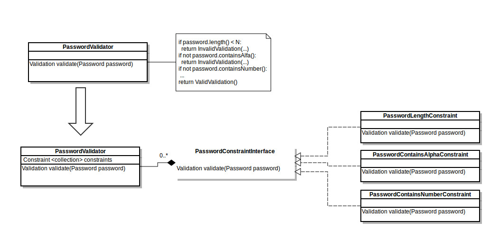

## Command pattern

Útil para reducir condicionales y permitir la extensibilidad de las clases. Relacionado con el principio Open-Closed.




	

```php
class PasswordValidator {

    const MIN_LENGTH = 8;

    public function validate($password) {
        if (strlen($password) < self::MIN_LENGTH) {
            return new InvalidValidation(sprintf('Password must contain at least %d chars', self::MIN_LENGTH));
        }
        if (!preg_match('/[A-Z]+/', $password)) {
            return new InvalidValidation(sprintf('Password must contain an uppercase'));
        }
        if (!preg_match('/[0-9]+/', $password)) {
            return new InvalidValidation(sprintf('Password must contain a number'));
        }
        // Many other validations
        return new ValidValidation();
    }
}
```

```php
class PasswordValidator {

    private $rules = array();

    public function addRule(PasswordRule $rule) {
        $this->rules[] = $rule;
    }

    public function validate($password) {
        foreach ($this->rules as $rule) {
            $validation = $rule->validate($password);
            if ($validation->isInvalid()) {
                return $validation;
            }
        }
        return new ValidValidation();
    }
}

$validator = new PasswordValidator();
$validator->addRule(new PasswordRules\MinLength(8));
$validator->addRule(new PasswordRules\ContainsUppercase());
$validator->addRule(new PasswordRules\ContainsNumeric());
//
$validator->validate('my password');

```     